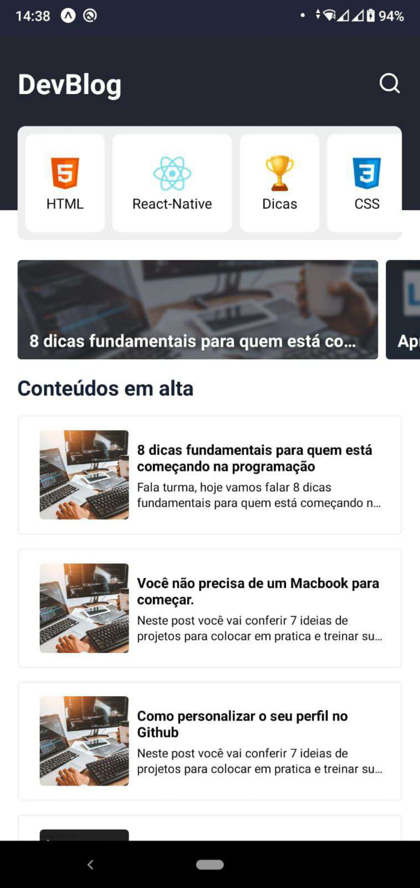
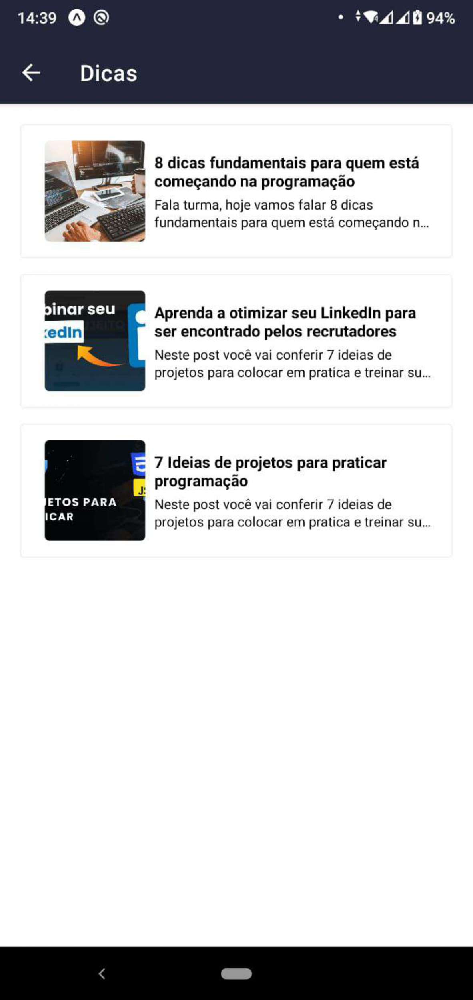
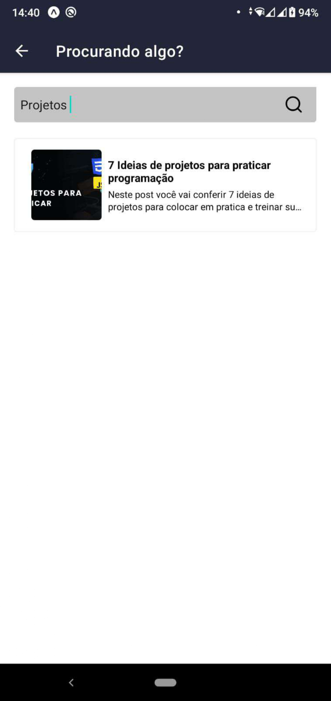
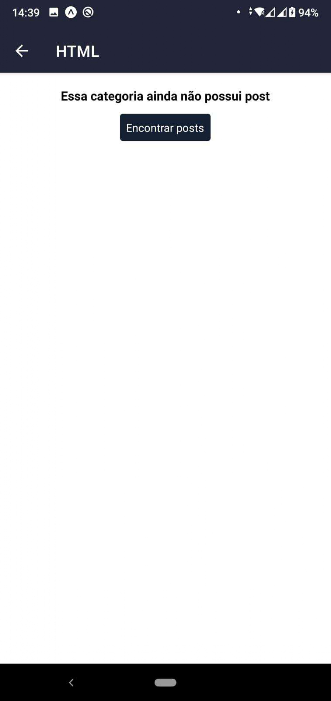

<h1 align="center">DevBlog</h1>

## 💻 Projeto
Aplicativo DevBlog desenvolvido junto com Sujeito Programador (Matheus Fraga) no Insider React-Native 5.0.

  
  
  
  
  

## ✨ Tecnologias

-   [ ] React Native
-   [ ] Javascript
-   [ ] Expo
-   [ ] Async Storage
-   [ ] Strapi API
-   [ ] Vector Icons
-   [ ] Animatable
-   [ ] useNavigation

 

  <small>Desenvolvido por Isaias Tortorele - Junho/2022</small>

   
   

